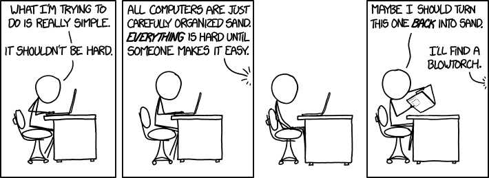

#Programming is hard.

http://www.quora.com/Why-is-programming-so-hard-1

=====
thought gathering:
=====

the majority of our time is spent trying to solve a tiny problem.
you could lose most of a full workday to that problem.
each tiny problem seems like a monolith standing between you and progress.

##THAT'S OKAY

software development is a slow process

why don't the docs ever address my problem?

Any modern language is so big no one knows it all. Frameworks really are harder than the lang &mdash; Mikel Berger (@mikelberger) [August 24, 2015](https://twitter.com/mikelberger/status/635871479339556864)

You're not alone!

Every single developer has these problems every single day.

It's easy to get bogged down in what's blocking your progress and lose sight of the big picture.

This seems like it's taking forever to move forward, but when the project is finished, the man hours being saved quickly add up.

#How to cope:

1. share your experiences with fellow developers
2. the problem you are having doesn't make you bad at your job.
3. when you solve a problem that took a lot of time, document what the problem was and what steps you took to overcome the obstacle.
